# Video Converter

`Video Converter` is an iOS video conversion app built on AVFoundation.
It converts source videos into any output format/preset combination that iOS reports as compatible for the selected file.

## Core Features
- Local-first conversion pipeline (`AVAssetExportSession`).
- Dynamic capability detection per source:
  - compatible export presets,
  - compatible output file types.
- Minimal 3-step flow: `Source -> Convert -> Result`.
- Advanced controls are collapsed by default:
  - preset override,
  - output format override,
  - clip start/end,
  - optimize for network use.
- Photos + Files import paths.
- Cancel conversion while exporting.
- Save converted output to Photos and share output files.
- Persisted conversion settings across launches.

## Build
```bash
xcodebuild -project AwesomeApp.xcodeproj -scheme AwesomeApp -destination 'platform=iOS Simulator,name=iPhone 16' build
```

## Automated Verification
- `swift test`: PASS (9 tests).
- `xcodebuild` iOS Simulator build:
  - iPhone 13 mini: PASS
  - iPhone 16: PASS
  - iPhone 16 Pro Max: PASS

## Manual/Simulator QA
- App install + launch on all 3 target simulators: PASS.
- Screen-fit checks (source/convert/result layouts): PASS on mini/regular/pro max.
- Light + Dark mode source-screen checks: PASS on mini/regular/pro max.
- Full click-based import/convert/save validation: PARTIAL.
  - Reason: this terminal workflow can boot/install/launch/screenshot simulators but does not provide reliable tap automation for full interactive click-through flows.
  - Mitigation: added `SHOWCASE_STEP` launch mode for deterministic UI state capture (`source`, `convert`, `result`).

## Showcase
### iPhone mini
<p>
  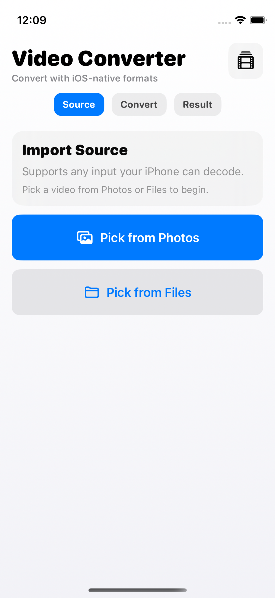
  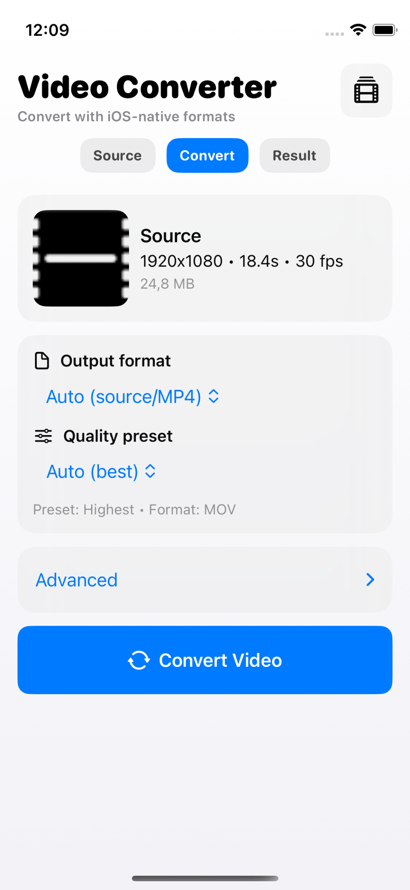
  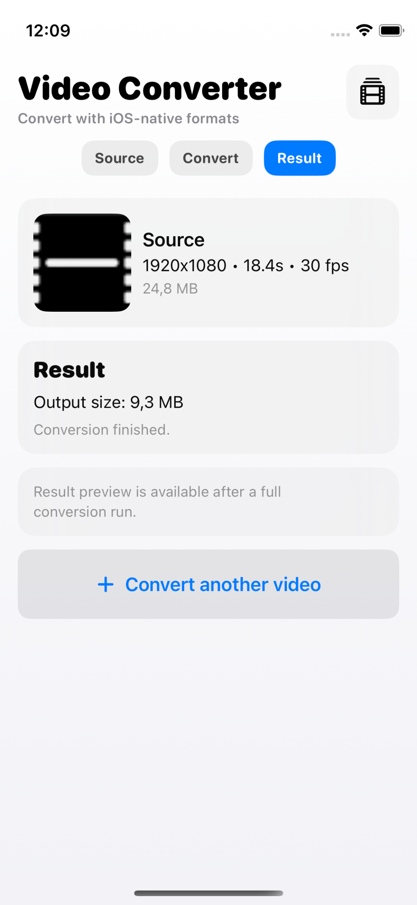
</p>

### iPhone regular
<p>
  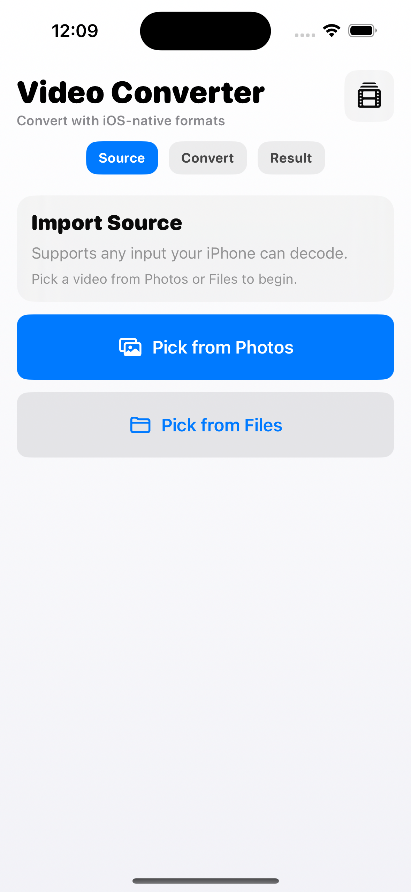
  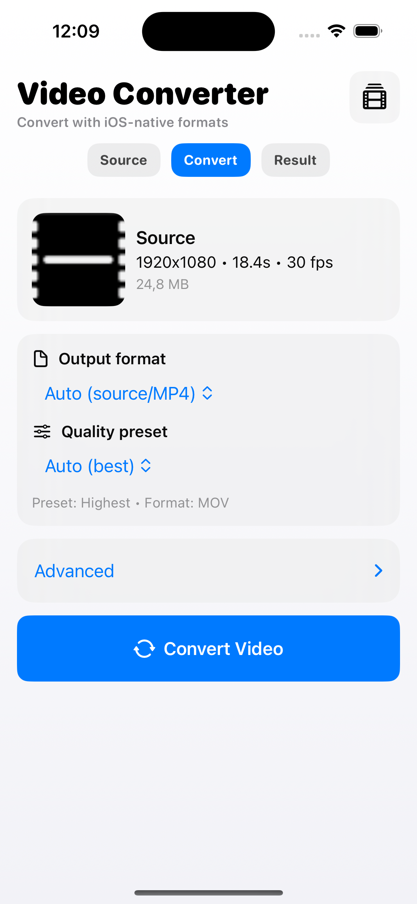
  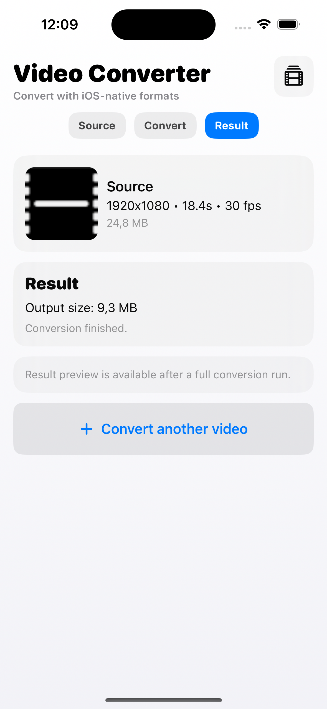
</p>

### iPhone Pro Max
<p>
  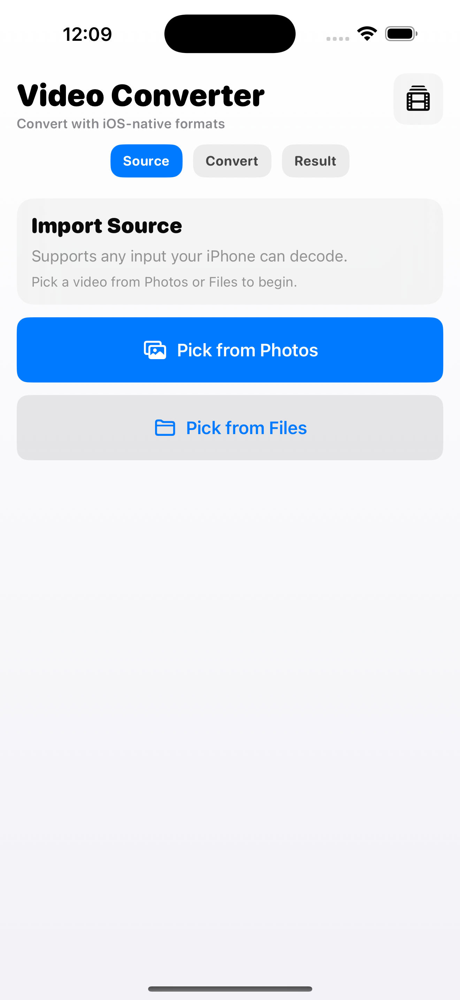
  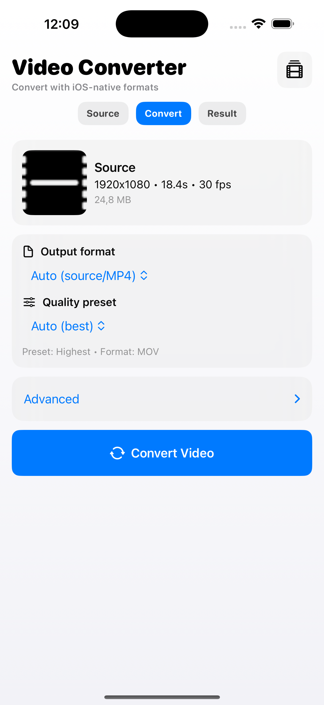
  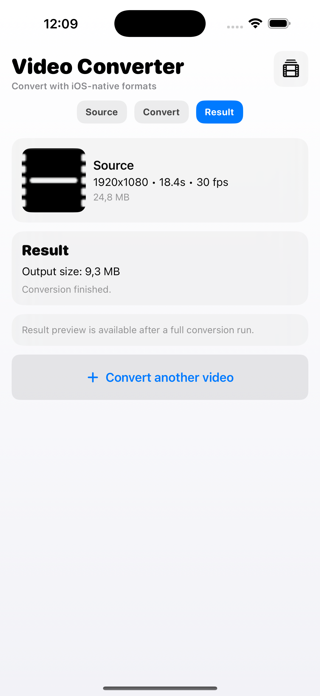
</p>

### Dark Mode Source Checks
<p>
  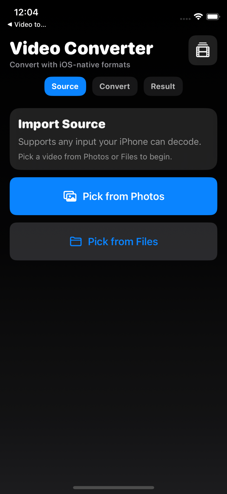
  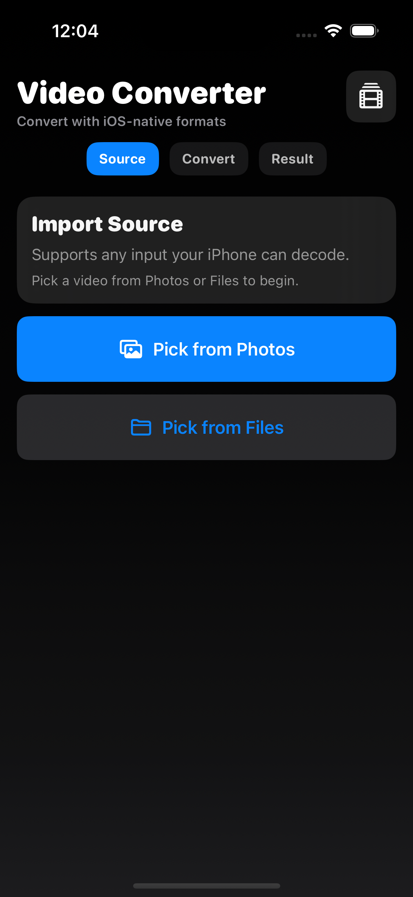
  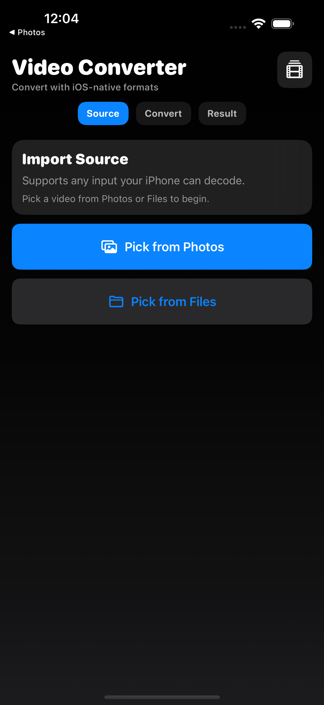
</p>
