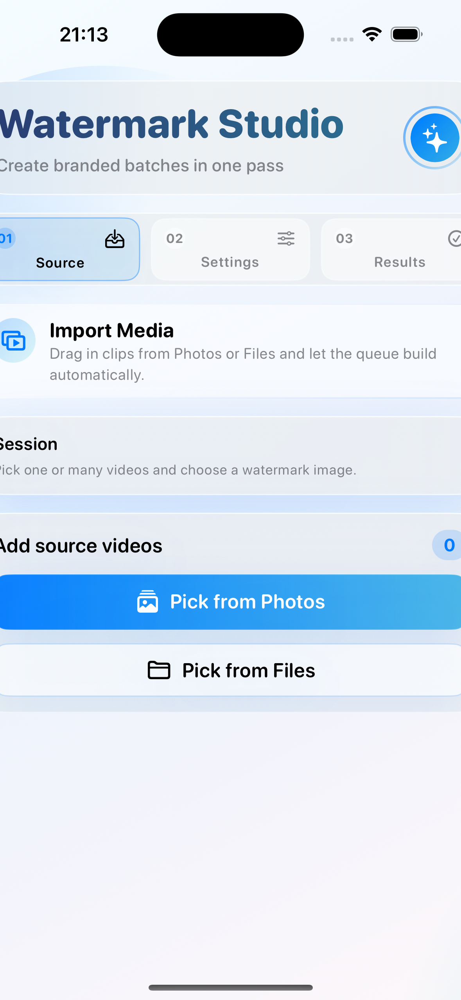
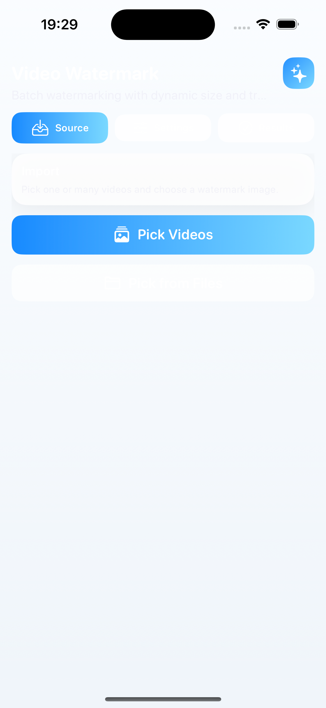

# Video Watermark

Video Watermark is a local-first iOS app for adding image watermarks to multiple source videos and saving stamped outputs.

## Core Features
- Batch process several videos in one run.
- Pick watermark image from Photos.
- Tune size, opacity, and placement (`X/Y` sliders plus quick presets).
- Dynamic placement is adapted to source video render size.
- Supports Photos and Files imports.
- Cancel long-running exports.

## Screenshots




### UI touchpoints
- New light/fresh visual style with gradient backdrop, rounded glass cards, and clearer step hierarchy.
- Updated processing controls for watermark opacity, size, and position in one flow.
- Improved state indicators for batch jobs and per-file export progress.

## Watermark sizing approach
- Convert each source track’s `naturalSize` with `preferredTransform`.
- Calculate a base watermark width from source width and `sizePercent`.
- Preserve original watermark aspect ratio and keep result within:
  - 90% of source width
  - 25% of source height
  - minimum 18pt edge and 18pt height
- Clamp placement values to source bounds using normalized X/Y percentages (0..100).

## Build and launch
```bash
xcodebuild -project AwesomeApp.xcodeproj -scheme AwesomeApp -destination 'platform=iOS Simulator,name=iPhone 16,OS=18.6' build
```

## Verification
```bash
swift test --parallel
```

## Notes
- Light, gradient-based UI style with rounded cards and compact steps.
- Output uses local AVFoundation composition and `AVVideoCompositionCoreAnimationTool`.
